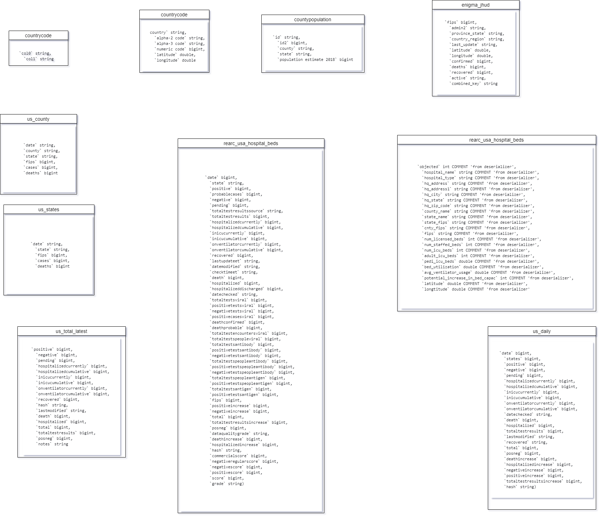

# COVID-19 Data Exploration with AWS Tools

Greetings! In this technical overview, we'll navigate through our COVID-19 data analysis project using user-friendly AWS tools. Let's delve into our technical journey.

## Our Data Path

1. **Data Storage**: We initiated our project by securely storing data in an AWS S3 bucket, ensuring both safety and scalability.

2. **Data Cataloging**: Leveraging AWS Glue, we cataloged our data. This process automated the organization, simplifying data management.

3. **Data Querying**: AWS Athena empowered us to perform SQL-like queries on the cataloged data, enhancing our ability to explore and analyze.

4. **Data Warehousing**: We seamlessly transitioned our processed data from Athena to AWS Redshift using AWS Glue. Redshift provided a robust data warehousing solution.

## AWS Tools in Action

- **AWS S3 Bucket**: Our trusted storage, safeguarding data efficiently.
- **AWS Glue**: The organizer, cataloging data for easy access.
- **AWS Athena**: Our query assistant, enabling flexible data exploration.
- **AWS Redshift**: The data warehouse, offering optimized storage and analysis.

## Implementation Steps

1. **Data Storage**: Dive into AWS S3, understand its capabilities, and learn how to store data securely.

2. **Data Cataloging**: Explore AWS Glue, master cataloging, and use a crawler for seamless updates.

3. **Data Querying**: Get hands-on with AWS Athena. Craft SQL-like queries for data exploration.

4. **Data Warehousing**: Utilize AWS Glue to smoothly transfer data to Redshift for advanced analysis.

## Concluding the Data Journey

By harnessing AWS tools, we've constructed a streamlined data pipeline for insightful COVID-19 analysis. From storage in S3 to cataloging with Glue, querying via Athena, and warehousing with Redshift, each step was meticulously orchestrated for a smooth and efficient analysis process.

## An Overview of Our Project Flow

## Data Model

